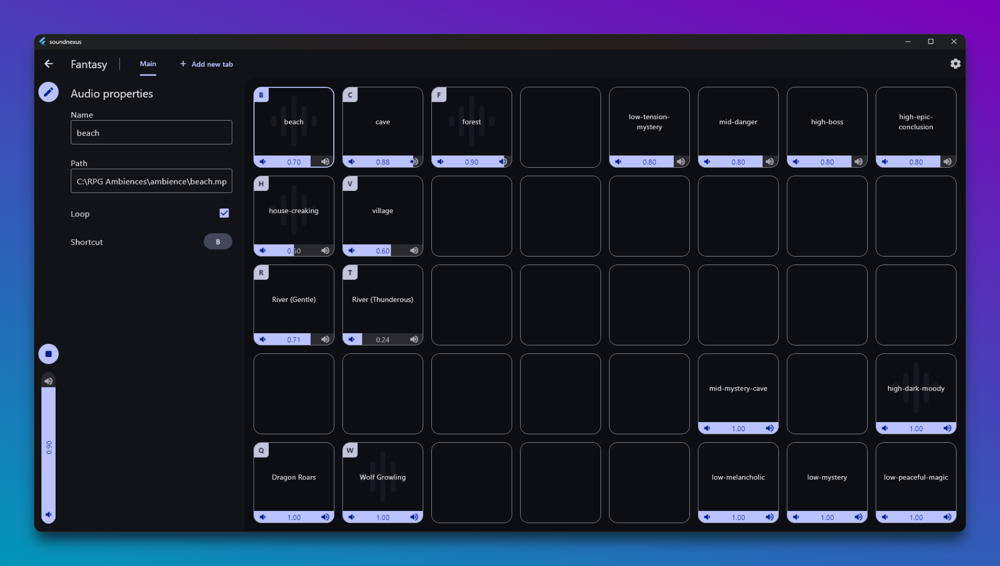

# SoundNexus

SoundNexus is a multiplatform soundboard app made with Flutter to use with
tabletop RPGs, podcasts, or any other activity where you need to control dozens
of sounds simultaneously.

## Tasks

- [x] Simultaneous playing audios
- [x] Independent and global volumes
- [x] Independent loop option
- [x] Tabs on Project page
- [ ] Keyboard shortcuts to play/pause audios
- [ ] Time seeker for each audio
- [ ] Group audios together with options to play the group in sequence or simultaneously
- [ ] Unit/UI tests

# Architecture

The project's organization is based on Flutter's MVVM architecture. State
management was made as simple as possible, using `ChangeNotifier` for View
Models, `context_watch` for reactivity and `get_it` as service locator.

For more information on how it works, read [Architecting Flutter Apps](https://docs.flutter.dev/app-architecture).

Not using Riverpod, Provider, BLoC, etc., makes View Models creation and usage
intentional, with no dependencies on inherited widgets from somewhere else in
the code, which I find less error-prone. The same goes for using dependency
injection instead of having parameterless View Models that get everything
through the service locator.

## Flutter Modifications

Modification to Flutter files are documented in [flutter_modifications.md](flutter_modifications.md).
